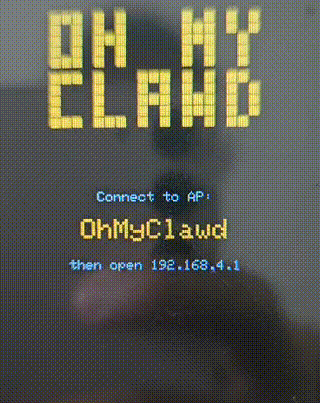
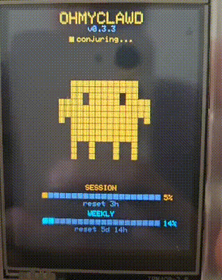

```
 ██████  ██   ██     ███    ███ ██    ██
██    ██ ██   ██     ████  ████  ██  ██
██    ██ ███████     ██ ████ ██   ████
██    ██ ██   ██     ██  ██  ██    ██
 ██████  ██   ██     ██      ██    ██

 ██████ ██       █████  ██     ██ ██████
██      ██      ██   ██ ██     ██ ██   ██
██      ██      ███████ ██  █  ██ ██   ██
██      ██      ██   ██ ██ ███ ██ ██   ██
 ██████ ███████ ██   ██  ███ ███  ██████
```

Claude Code usage monitor on the ESP32-2432S028R (CYD 2.8") with pixel art animations.

 |  | 
:---:|:---:|:---:

Displays real-time Claude Code session and weekly usage with animated pixel sprites and a digital clock.

## Features

- **Real-time usage bars** — session and weekly utilization at a glance
- **13 animated pixel sprites** — changes based on Claude Code activity state
- **Tmux session detection** — knows when Claude is waiting for your input
- **OTA firmware updates** — checks GitHub releases on boot, tap to update
- **Configurable via captive portal** — no code changes needed for WiFi/daemon setup
- **Pixel clock mode** — retro digital clock with second-progress bar

## Hardware

- **Board:** ESP32-2432S028R (CYD 2.8")
- **Display:** 2.8" ILI9341 320×240 TFT
- **Touch:** XPT2046 resistive touchscreen
- **Connectivity:** WiFi (2.4 GHz)

---

## macOS Setup (A to Z)

### Prerequisites

- macOS with [Homebrew](https://brew.sh) installed
- [PlatformIO](https://platformio.org/) for flashing firmware (`brew install platformio`)
- Claude Code CLI installed (`claude --version` to verify)
- Claude Pro / Max subscription (required for rate-limit headers)

---

### Step 1 — Generate an OAuth token

On macOS, Claude Code stores credentials in the Keychain (no `.credentials.json` file). The daemon needs a long-lived token instead.

```bash
claude setup-token
```

Copy the printed token (`sk-ant-oat01-...`). **You won't see it again** — save it in a password manager.

> This token is tied to your Claude Pro subscription, not billed as API usage.

**Important:** do not set `CLAUDE_CODE_OAUTH_TOKEN` in your shell profile — it will override your normal Claude Code login and break `/usage` inside Claude Code. Only pass it to the daemon process:

```bash
# check if accidentally set
echo $CLAUDE_CODE_OAUTH_TOKEN

# if set, unset it
unset CLAUDE_CODE_OAUTH_TOKEN
```

---

### Step 2 — Flash the firmware

Connect the CYD board via USB, then find the port:

```bash
ls /dev/cu.usbserial-*
```

Update `upload_port` in `platformio.ini` to match, then flash:

```bash
pio run -e cyd -t upload
```

---

### Step 3 — Set a static IP on your Mac

The ESP32 will poll your Mac's IP. If the IP changes, it loses connection.

**System Settings → Network → Wi-Fi → Details → TCP/IP → Configure IPv4 → Manual**

- IP Address: `192.168.1.200` (or any unused address in your range)
- Subnet Mask: `255.255.255.0`
- Router: your router's IP (usually `192.168.1.1`)

Verify:

```bash
ipconfig getifaddr en0
# should return your chosen static IP
```

---

### Step 4 — Start the daemon

```bash
cd daemon
CLAUDE_CODE_OAUTH_TOKEN=sk-ant-oat01-... ./ohmyclawd-daemon
```

Verify it's working:

```bash
curl http://localhost:8787/usage
# expect: {"s":22,"sr":173,"w":18,...,"ok":true}

curl http://localhost:8787/healthz
# expect: ok
```

---

### Step 5 — Autostart with launchd

To run the daemon automatically on login:

```bash
cd daemon
./install.sh   # no sudo needed on macOS
```

The script will prompt you to paste your OAuth token (from Step 1). It then:
- Builds the binary and installs to `~/.local/bin/ohmyclawd-daemon`
- Registers a launchd agent at `~/Library/LaunchAgents/local.ohmyclawd-daemon.plist`
- Starts the daemon immediately

The daemon starts automatically on every login. No manual steps needed after this.

Check logs:

```bash
tail -f /tmp/ohmyclawd-daemon.log
```

To stop/restart:

```bash
launchctl unload ~/Library/LaunchAgents/local.ohmyclawd-daemon.plist
launchctl load ~/Library/LaunchAgents/local.ohmyclawd-daemon.plist
```

> **Note:** `install.sh` builds from source — requires Go installed (`brew install go`).

---

### Step 6 — Configure the CYD

On first boot, the CYD creates a WiFi access point:

1. Connect to **`OhMyClawd`** on your Mac or phone
2. A captive portal opens (or browse to `192.168.4.1`)
3. Click **Configure WiFi**
4. Enter your **WiFi SSID** and **password**
5. Set **Daemon URL** to your Mac's static IP — **do not use `.local`**:
   ```
   http://192.168.1.200:8787
   ```
6. Set your **Timezone** (e.g. `MYT-8` for Malaysia, see [POSIX TZ format](https://www.gnu.org/software/libc/manual/html_node/TZ-Variable.html))
7. Save — the CYD reboots and connects

Settings persist across reboots. Hold touch for 5 seconds to reset and reconfigure.

---

### Step 7 — Done!

The CYD shows your Claude Code session and weekly usage. Tap to switch between sprite and clock modes.

---

## Linux Setup

**One-liner:**

```bash
curl -fsSL https://raw.githubusercontent.com/amirahnasihah/ohmyclawd-mac/main/install.sh | sudo bash
```

This downloads the latest binary, installs to `/usr/local/bin`, and sets up a systemd service.

---

## Sprite States

The animated sprite changes based on your Claude Code status (requires Claude Code sessions running in tmux):

| State | Sprite | Trigger |
|---|---|---|
| Needs input | expression-surprise, expression-wink | Claude session idle >30s in tmux |
| Rate limited | expression-sleep, idle-breathe | Session usage ≥ 80% |
| Heavy usage | work-think, idle-look-around | Session usage 50–79% |
| Moderate usage | work-coding, dance-djmix | Session usage 25–49% |
| Light usage | dance-bounce, dance-sway, bounce-dj, sway-dj, idle-blink | Session usage < 25% |

---

## Updating

### Firmware (OTA)

After the first USB flash, all future updates are over-the-air — no USB needed.

**How to release a new firmware version:**

```bash
git tag v1.0.1
git push origin v1.0.1
```

GitHub Actions automatically builds `ohmyclawd-firmware.bin` and creates a release. On next reboot, the ESP32 checks GitHub, detects the newer version, and prompts on screen to update. Tap to confirm — it downloads and flashes itself via WiFi.

> First flash must always be via USB (`flash-omc` or `pio run -e cyd -t upload`). OTA only works after the correct firmware (with your fork's OTA URL) is already on the device.

### Daemon (macOS)

Re-run the install script:

```bash
cd daemon && ./install.sh
```

### Daemon (Linux)

```bash
curl -fsSL https://raw.githubusercontent.com/amirahnasihah/ohmyclawd-mac/main/install.sh | sudo bash
```

---

## Daemon

The daemon runs on your machine (where Claude Code runs), polls the Anthropic API for rate-limit headers, and serves usage data over HTTP.

See [daemon/README.md](daemon/README.md) for full environment variables, endpoints, and fake mode.

---

## Project Structure

```
├── platformio.ini        # Build config, pin definitions, library deps
├── claudepix/            # Source HTML animations from claudepix
├── daemon/               # ohmyclawd daemon (Go) - polls Anthropic API
│   ├── main.go           # HTTP server on :8787
│   ├── probe.go          # Anthropic rate-limit header polling
│   ├── loop.go           # Probe scheduling with backoff
│   ├── handlers.go       # /usage, /healthz, /metrics endpoints
│   ├── usage.go          # Usage struct (JSON wire format)
│   ├── creds.go          # Claude OAuth credential loader
│   ├── fake.go           # Fake mode for testing
│   ├── install.sh        # Install script (macOS + Linux)
│   ├── systemd/          # systemd service file (Linux)
│   └── launchd/          # launchd plist template (macOS)
├── .github/workflows/    # CI: test + release binary
└── src/
    ├── main.cpp          # Firmware source
    └── sprite_frames.h   # Generated animation frame data (13 presets)
```

---

## How It Works

The daemon authenticates with the Anthropic API using your Claude OAuth token. On macOS, generate this token via `claude setup-token`. On Linux, the daemon reads it directly from `~/.claude/.credentials.json`.

It makes lightweight requests to the Anthropic API and reads the rate-limit response headers to determine your current session and weekly usage percentages. No messages are sent or read — it only inspects HTTP headers.

---

## Credits

- Pixel animations from [claudepix](https://claudepix.vercel.app/)

## Disclaimer

This project is unofficial and not affiliated with Anthropic. It relies on undocumented rate-limit headers from the Anthropic API which may change without notice. The daemon requires read-only access to your Claude Code credentials — it does not transmit, store, or expose your tokens over the network. Use at your own risk.

## License

[MIT](LICENSE)
